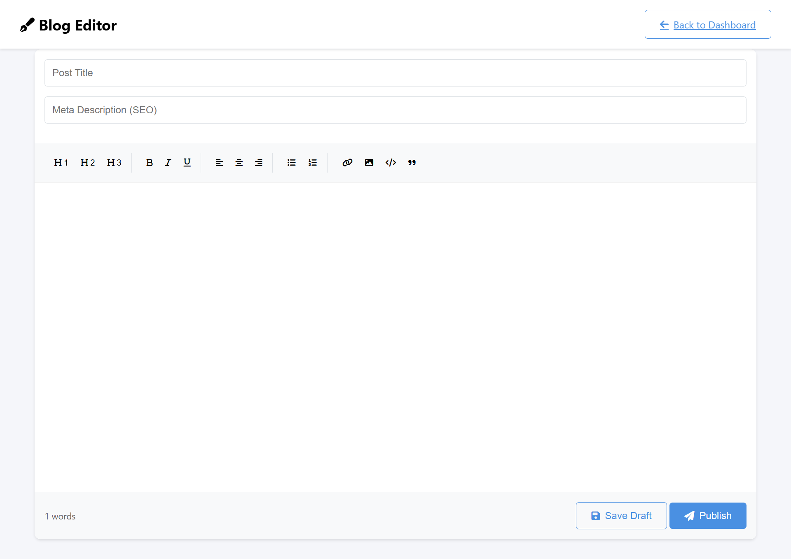
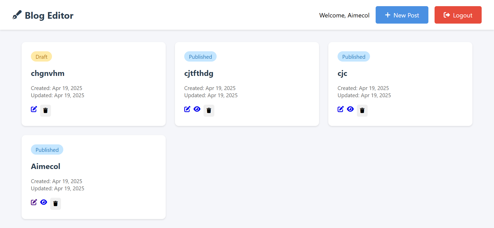
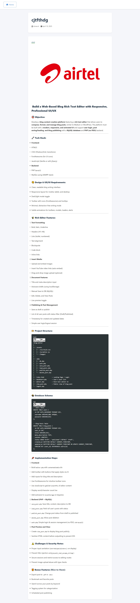
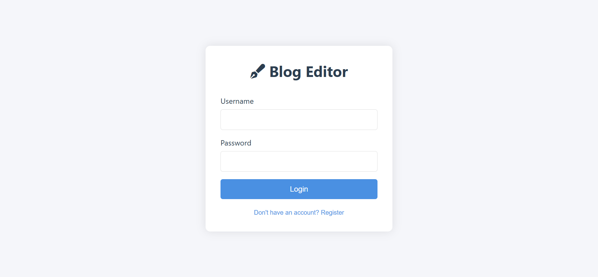

# Blog Editor

A web-based blog content creation platform featuring a rich text editor with a responsive, professional UI/UX. This system allows users to compose, format, and manage blog posts with a modern interface similar to Medium or WordPress.


## Features

### Rich Text Editor

- Text Formatting (Bold, Italic, Underline)
- Headers (H1-H3)
- Lists (ordered and unordered)
- Text alignment options
- Blockquotes
- Code blocks
- Link insertion
- Image embedding
- Auto-save functionality
- Word count tracking



### Dashboard & Post Management

- View all posts with status indicators
- Edit existing posts
- Delete posts
- Publish/unpublish posts
- Filter posts by status



### Post Viewing

- Clean, responsive post layout
- SEO-friendly meta descriptions
- Author attribution
- Creation and update timestamps



### User Authentication

- Secure login system
- User registration
- Session management
- Password hashing



## Technical Stack

### Frontend

- HTML5
- CSS3 (Flexbox/Grid, transitions)
- FontAwesome (for UI icons)
- JavaScript (Vanilla)
- Responsive design for all screen sizes

### Backend

- PHP (mysqli)
- MySQL database
- XAMPP stack

## Database Schema

```sql
-- Users Table
CREATE TABLE users (
  id INT AUTO_INCREMENT PRIMARY KEY,
  username VARCHAR(100) UNIQUE,
  password VARCHAR(255)
);

-- Blog Posts Table
CREATE TABLE blog_posts (
  id INT AUTO_INCREMENT PRIMARY KEY,
  user_id INT,
  title VARCHAR(255),
  meta_description TEXT,
  content LONGTEXT,
  status ENUM('draft', 'published') DEFAULT 'draft',
  created_at DATETIME DEFAULT CURRENT_TIMESTAMP,
  updated_at DATETIME DEFAULT CURRENT_TIMESTAMP ON UPDATE CURRENT_TIMESTAMP,
  FOREIGN KEY (user_id) REFERENCES users(id)
);
```

| #
# Project Structure
```
| airtel.png
│ blog_view.png
│ blogs.png
│ editor.png
│ login.png
│
├── php/
│   ├── auth.php          # Authentication handlers
│   ├── db.php           # Database connection
│   ├── delete_post.php  # Post deletion handler
│   ├── logout.php       # Logout handler
│   └── save_post.php    # Post saving handler
│
├── index.php          # Landing page/Login
├── dashboard.php      # Post management dashboard
├── editor.php         # Rich text editor
├── view_post.php      # Public post view
└── README.md         # This documentation
```

## Installation

1. Install XAMPP on your system
2. Clone this repository to your XAMPP's htdocs folder
3. Create a new database named 'blog_editor' in phpMyAdmin
4. Import the provided db.sql file to set up the database schema
5. Access the application through your browser at `http://localhost/blog`

## Security Features

- SQL injection prevention using mysqli_real_escape_string()
- Password hashing for secure storage
- Session-based authentication
- XSS prevention through input sanitization
- Secure post editing with user verification

## Browser Compatibility

- Chrome (recommended)
- Firefox
- Safari
- Edge
- Opera

## License

This project is licensed under the MIT License - see the LICENSE file for details.

## Contributing

1. Fork the repository
2. Create your feature branch
3. Commit your changes
4. Push to the branch
5. Create a new Pull Request
